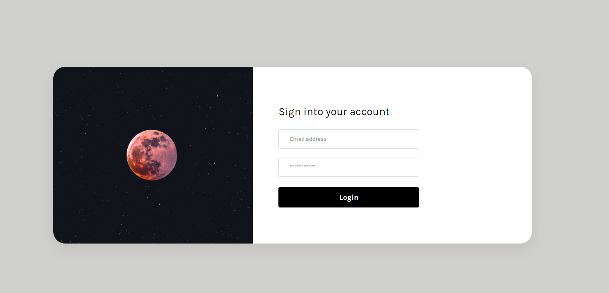
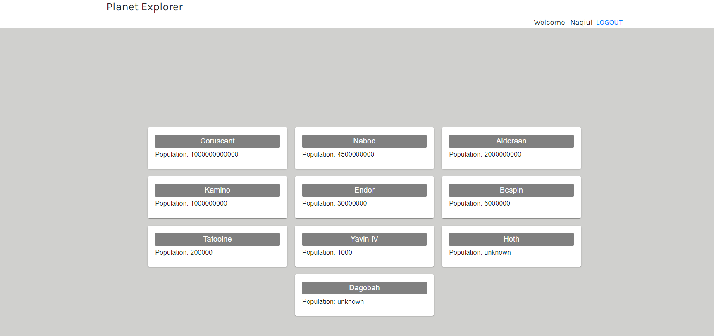

# Planet explorer app

Planet explorer application enable users to view list of planets based on population

## Available Scripts

In the project directory, you can run:

### `yarn install`

### `yarn start`

Runs the app in the development mode.\
Open [http://localhost:3000](http://localhost:3000) to view it in the browser.

Planet explorer app consist of following screens.
1) Login screen

2) Planets screen:

The page will reload if you make edits.\
You will also see any lint errors in the console.
